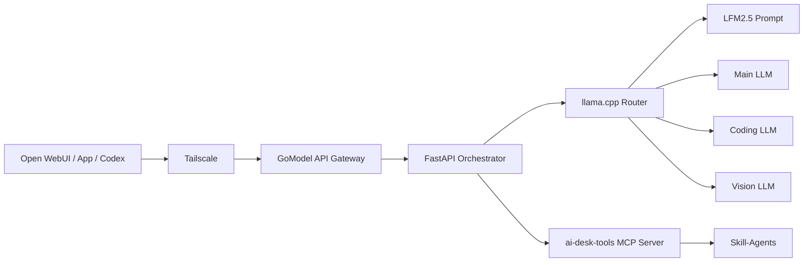

# คู่มือระบบ Local AI ฉบับสมบูรณ์

เอกสารนี้อธิบายการติดตั้งและใช้งานระบบร่วมกันทั้งสามส่วน:

```text
Skill-Agents            = วิธีคิด, skills และ workflows
ai-desk-tools           = MCP tools ที่ลงมือทำงานบนเครื่อง
local-llm-orchestrator  = API, model routing และ llama.cpp runtime
```

ระบบไม่มีหน้าแชตในตัว ให้ใช้ Open WebUI, GoModel, Codex หรือ client ที่รองรับ OpenAI-compatible API

## Repository Map

| ระบบ | Repository | สถานะ |
|---|---|---|
| Skills และ workflows | [ntaffzii/Skill-Agents](https://github.com/ntaffzii/Skill-Agents) | มีชื่อ repo ในเอกสารปัจจุบัน |
| MCP tools | [ntaffzii/ai-desk-tools](https://github.com/ntaffzii/ai-desk-tools) | มีชื่อ repo ในเอกสารปัจจุบัน |
| Local LLM runtime | `ntaffzii/local-llm-orchestrator` | ชื่อ repo ที่แนะนำ ยังต้องสร้างและ push |

Workspace ปัจจุบันรวมทั้งสามส่วนไว้สำหรับพัฒนา:

```text
Skill-Agents/
├── skills/                  # Skills แบบ native
├── Skill.md/                # Skills แบบ portable
├── workflows/               # Playbooks
├── data/                    # Registries
├── mcp-tools/               # Working copy ของ ai-desk-tools
└── local-llm/               # Working copy ของ local-llm-orchestrator
```

เมื่อนำขึ้น GitHub ควรแยกเป็นสาม repo เพื่อให้ติดตั้ง อัปเดต และกำหนดสิทธิ์ได้อิสระ

## Architecture



### หน้าที่แต่ละส่วน

**Skill-Agents**

- บอก agent ว่าควรทำงานอย่างไร
- มี skill สำหรับ coding, review, research, productivity และงานส่วนตัว
- มี workflow ที่บอกลำดับขั้นตอน
- ไม่มี inference server และไม่รันคำสั่งเอง

**ai-desk-tools / mcp-tools**

- เปิด MCP server แบบ stdio หรือ streamable HTTP
- มี `skill-runtime` สำหรับค้นหาและโหลด Skill-Agents
- มี tools สำหรับ filesystem, Git, GitHub, browser, memory, RAG และ integrations
- บังคับ allowed roots, command allowlist และ audit policy

**local-llm-orchestrator**

- เปิด OpenAI-compatible API
- แสดง physical และ virtual models
- เลือกโมเดลและปรับ prompt
- ส่ง tool schemas ให้โมเดลและทำ MCP tool loop
- ไม่โหลด GGUF เอง แต่ส่งงานให้ llama.cpp Router

**llama.cpp Router**

- โหลด GGUF เข้า RAM/VRAM
- ทำ inference และ token streaming
- โหลด/ถอดโมเดลตาม request
- จำกัดจำนวนโมเดลที่อยู่ในหน่วยความจำพร้อมกัน

## Request Flow

### แชตทั่วไป

```text
Open WebUI เลือก main-llm
-> GoModel
-> Orchestrator
-> llama.cpp โหลด main model
-> ส่ง token กลับ Open WebUI
```

### ปรับ Prompt

```text
Open WebUI เลือก main-llm-improved
-> Orchestrator เรียก LFM2.5
-> LFM2.5 rewrite prompt
-> ส่ง prompt ใหม่เข้า main model
-> ส่งคำตอบกลับ
```

### ใช้ Skill และ MCP

```text
Open WebUI เลือก main-llm-tools
-> Orchestrator ส่ง skill-agent policy และ MCP schemas
-> โมเดลเรียก route_request
-> skill-runtime เลือก workflow/skills/toolsets
-> โมเดลเรียก build_agent_context
-> โมเดลทำตาม skill และเรียก action tools ที่อนุญาต
-> ส่งคำตอบสุดท้ายกลับ
```

## Prerequisites

- Windows 10/11
- Git
- Python 3.11 หรือ 3.12
- Docker Desktop ใช้ Linux/WSL2 engine
- NVIDIA driver ถ้าจะใช้ CUDA
- GGUF model files
- Tailscale หากใช้งานจากเครื่องอื่น

ตรวจสอบ:

```powershell
git --version
python --version
docker --version
docker compose version
```

## 1. ติดตั้ง Skill-Agents

```powershell
git clone https://github.com/ntaffzii/Skill-Agents.git
cd Skill-Agents
```

Skill แบบ native สำหรับ Codex:

```powershell
Copy-Item -Recurse .\skills\* "$env:USERPROFILE\.codex\skills\"
```

หรือใช้ skill ผ่าน MCP โดยไม่ต้อง copy ทุกไฟล์ ซึ่งเป็นวิธีหลักของ Local LLM system นี้

ไฟล์ที่ควรอ่าน:

```text
examples/local-llm-agent-prompt.md
docs/SKILL_RUNTIME_FLOW.md
docs/LOCAL_LLM_SETTINGS.md
```

## 2. ติดตั้ง MCP Tools

ถ้าใช้ repo แยก:

```powershell
git clone https://github.com/ntaffzii/ai-desk-tools.git
cd ai-desk-tools
```

ถ้าใช้ workspace นี้:

```powershell
cd C:\Users\natth\Documents\Skill-Agents\mcp-tools
```

ติดตั้ง:

```powershell
python -m venv .venv
.\.venv\Scripts\python.exe -m pip install --upgrade pip
.\.venv\Scripts\python.exe -m pip install -r requirements.txt
```

ทดสอบ:

```powershell
.\.venv\Scripts\python.exe -m pytest -q
```

### เปิด MCP สำหรับ Orchestrator ใน Docker

```powershell
.\.venv\Scripts\python.exe server_http.py `
  --transport streamable-http `
  --host 0.0.0.0 `
  --port 8765
```

URL จาก Orchestrator container:

```text
http://host.docker.internal:8765/mcp
```

ข้อควรระวัง: `0.0.0.0` อาจทำให้เครื่องอื่นใน LAN เห็นพอร์ตนี้ ให้ใช้ Windows Firewall จำกัด Docker/WSL interface และห้าม port-forward พอร์ต `8765`

### MCP แบบ stdio

สำหรับ Codex, Claude Desktop หรือ client ที่เปิด process เอง:

```text
command: <ai-desk-tools>\.venv\Scripts\python.exe
args:    <ai-desk-tools>\server.py
```

stdio และ HTTP ใช้ tools ชุดเดียวกัน แต่ Orchestrator container ต้องใช้ HTTP

## 3. เตรียม Local LLM Repository

ชื่อ repo ที่แนะนำ:

```text
GitHub: ntaffzii/local-llm-orchestrator
Local:  C:\Users\natth\Documents\local-llm-orchestrator
```

ระหว่างพัฒนาใน workspace นี้ source อยู่ที่:

```text
C:\Users\natth\Documents\Skill-Agents\local-llm
```

เตรียม environment:

```powershell
cd C:\Users\natth\Documents\Skill-Agents\local-llm
Copy-Item .env.docker.example .env.docker
```

แก้ `.env.docker`:

```env
ORCHESTRATOR_API_KEY=ใส่คีย์สุ่มยาว
ORCHESTRATOR_BIND_IP=127.0.0.1
ORCHESTRATOR_PORT=8090
LLAMA_MODELS_MAX=2
MCP_ENABLED=true
MCP_SERVER_URL=http://host.docker.internal:8765/mcp
MCP_TOOL_ALLOWLIST=route_request,build_agent_context,load_skill,load_workflow,list_toolsets,get_toolset
```

## 4. ใส่โมเดล

```text
local-llm/models/
├── prompt/LFM2.5-1.2B-Instruct-Q4_0.gguf
├── chat/gemma4-e2b-Q4_K_M.gguf
├── coding/qwen-coder-Q4_K_M.gguf
└── vision/
    ├── vision-model-Q4_K_M.gguf
    └── vision-model-mmproj.gguf
```

ชื่อไฟล์ข้างต้นเป็นค่าเริ่มต้น แก้ให้ตรงไฟล์จริงใน `config/models.ini`

Policy ที่แนะนำ:

```ini
[lfm2.5-prompt]
n-gpu-layers = 0

[gemma4-e2b]
n-gpu-layers = auto
```

ผลคือ LFM2.5 ใช้ CPU/RAM ส่วนโมเดลหลักให้ llama.cpp fit ลง GPU/VRAM

## 5. เปิดระบบ Local LLM

เปิด Docker Desktop และรอ Linux engine พร้อม

ตรวจ config และ model paths:

```powershell
Set-ExecutionPolicy -Scope Process Bypass
.\scripts\docker-validate.ps1
```

CPU:

```powershell
.\scripts\docker-up.ps1 -Build
```

NVIDIA CUDA:

```powershell
.\scripts\docker-up.ps1 -Cuda -Build
```

ตรวจสถานะ:

```powershell
.\scripts\docker-status.ps1
.\scripts\docker-logs.ps1 -Service all
```

Endpoints:

```text
Health:    http://127.0.0.1:8090/health
Ready:     http://127.0.0.1:8090/ready
Models:    http://127.0.0.1:8090/v1/models
API docs:  http://127.0.0.1:8090/docs
```

## 6. ทดสอบระบบ

```powershell
$key = "คีย์จาก .env.docker"
$headers = @{ Authorization = "Bearer $key" }

Invoke-RestMethod `
  -Uri http://127.0.0.1:8090/v1/models `
  -Headers $headers
```

ทดสอบแชต:

```powershell
$body = @{
  model = "main-llm"
  messages = @(
    @{ role = "user"; content = "อธิบายหน้าที่ของระบบนี้สั้น ๆ" }
  )
  stream = $false
} | ConvertTo-Json -Depth 10

$result = Invoke-RestMethod `
  -Uri http://127.0.0.1:8090/v1/chat/completions `
  -Method Post `
  -Headers $headers `
  -ContentType application/json `
  -Body $body

$result.choices[0].message.content
```

## 7. ต่อ Open WebUI

ถ้า Open WebUI อยู่บน host:

```text
Base URL: http://127.0.0.1:8090/v1
API Key:  ORCHESTRATOR_API_KEY
```

ถ้า Open WebUI อยู่ใน Docker:

```text
Base URL: http://host.docker.internal:8090/v1
```

โมเดลที่เลือกได้:

| Model | การทำงาน |
|---|---|
| `main-llm` | โมเดลหลักโดยตรง |
| `main-llm-improved` | LFM2.5 ปรับ prompt ก่อน |
| `main-llm-tools` | เปิด Skill-Agents และ MCP ทุก request |
| `auto` | เลือกโมเดลและเปิด workflow ตามกฎ |
| `coding` | coding model โดยตรง |
| `coding-improved` | LFM2.5 แล้วส่งเข้า coding model |
| `vision` | vision model |
| `prompt` | คุยกับ LFM2.5 โดยตรง |

เริ่มทดสอบ Skill ด้วย `main-llm-tools` ก่อน แล้วค่อยใช้ `auto`

## 8. ใช้ Skill-Agents

ถามผ่าน `main-llm-tools` เช่น:

```text
ตรวจ repository นี้และวางแผนเพิ่ม authentication endpoint
ใช้ Skill-Agents workflow ที่เหมาะสม และตรวจไฟล์แบบ read-only ก่อน
```

ลำดับที่ควรเกิด:

```text
route_request
-> build_agent_context
-> load skill/workflow ที่เกี่ยวข้อง
-> action tools ที่อยู่ใน allowlist
-> final response
```

ถ้าโมเดลไม่เรียก skill:

1. ตรวจว่าเลือก `main-llm-tools`
2. ตรวจ `MCP_ENABLED=true`
3. เปิด `GET /mcp/tools`
4. ตรวจว่า allowlist มี `route_request` และ `build_agent_context`
5. ใช้โมเดลหลักที่รองรับ tool calling

## 9. เพิ่ม Action Tools

Allowlist เริ่มต้นให้โมเดลอ่านเฉพาะ Skill routing ยังไม่ให้แก้ไฟล์

ตัวอย่าง read-only coding tools:

```env
MCP_TOOL_ALLOWLIST=route_request,build_agent_context,load_skill,load_workflow,list_toolsets,get_toolset,list_files,read_file,repo_index
```

อย่าเปิดทุก tool พร้อมกัน โดยเฉพาะ:

- command execution
- file write/delete
- email/chat sending
- database mutation
- issue/Notion updates

เพิ่มทีละ tool แล้วตรวจ `mcp-tools/config/tool_policy.json`

## 10. GoModel และ Tailscale

Production flow ที่แนะนำ:

```text
Remote device
-> Tailscale
-> GoModel API Gateway
-> Orchestrator :8090
```

GoModel รับผิดชอบ:

- user/API authentication
- rate limit และ quota
- usage log
- public-facing TLS/API policy

Orchestrator ควร bind `127.0.0.1` เมื่อ GoModel อยู่เครื่องเดียวกัน และ llama.cpp ไม่ควรถูก publish ออกจาก Docker network

## 11. Start/Stop ประจำวัน

เปิดตามลำดับ:

```text
1. Docker Desktop
2. MCP HTTP server
3. local-llm Docker Compose
4. GoModel
5. Open WebUI
```

ปิด:

```powershell
cd C:\Users\natth\Documents\Skill-Agents\local-llm
.\scripts\docker-down.ps1
```

MCP server หยุดด้วย `Ctrl+C` ใน terminal ที่เปิดไว้

## 12. Troubleshooting

### `/health` ผ่าน แต่ `/ready` ไม่ผ่าน

Orchestrator เปิดแล้ว แต่เชื่อม llama.cpp ไม่ได้ ตรวจ:

```powershell
.\scripts\docker-logs.ps1 -Service llama-router
```

### ไม่เห็นโมเดล

- ชื่อ section ใน `models.ini` ต้องตรง target ใน `models.json`
- filename ต้องตรงกับ GGUF จริง
- restart llama-router หลังแก้ `models.ini`

### Skill ไม่ทำงาน

```powershell
Invoke-RestMethod `
  -Uri http://127.0.0.1:8090/mcp/tools `
  -Headers $headers
```

ถ้า `enabled=false` ให้ตรวจ `.env.docker` และ restart Compose

### Docker container ติดต่อ MCP ไม่ได้

- MCP ต้องฟัง interface ที่ Docker เข้าถึงได้
- URL ต้องเป็น `host.docker.internal`, ไม่ใช่ `127.0.0.1`
- ตรวจ Windows Firewall

### CUDA ไม่ทำงาน

```powershell
docker run --rm --gpus all nvidia/cuda:12.8.1-base-ubuntu24.04 nvidia-smi
```

ถ้าคำสั่งนี้ไม่ผ่าน ให้แก้ Docker Desktop/WSL2/NVIDIA ก่อน

## Security Checklist

- ไม่ commit `.env`, `.env.docker`, GGUF หรือ logs
- ใช้ API key แบบสุ่มยาว
- เปิด MCP tools เท่าที่จำเป็น
- ให้ GoModel/Tailscale เป็นทางเข้าจากภายนอก
- ไม่เปิด llama.cpp `8080` และ MCP `8765` สู่ Internet
- สำรองเฉพาะ config/docs ไม่จำเป็นต้องสำรอง GGUF
- ตรวจ audit logs หลังเปิด tools ที่มี side effect

## Update Procedure

```powershell
# Skill-Agents
git pull

# ai-desk-tools
git pull
.\.venv\Scripts\python.exe -m pip install -r requirements.txt

# local-llm-orchestrator
git pull
docker compose --env-file .env.docker pull
.\scripts\docker-up.ps1 -Cuda -Build
```

ก่อน update production ให้ตรวจ changelog, backup config และทดสอบ `/ready`, `/v1/models`, direct chat และ Skill tool flow

