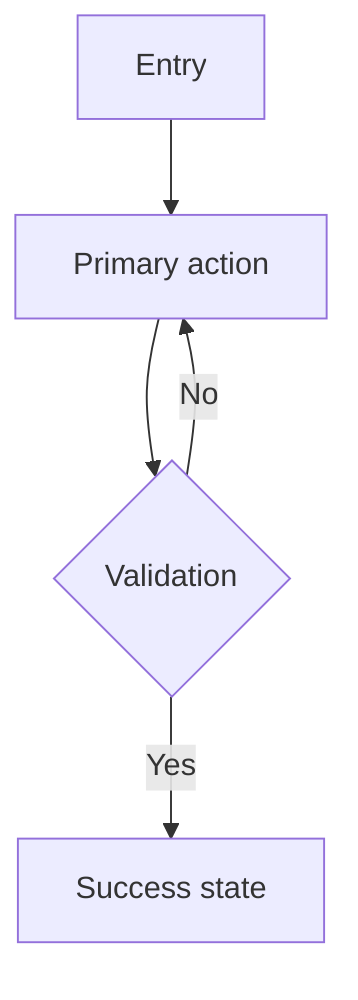

# Design Mode Workflow

Used in **Design mode** to create the UX/UI for a new (or redesigned) product and produce `UX-UI-DESIGN-DOC.md`. The structure adapts the **interview -> brief -> variants -> feedback -> finalize** loop from the `design-lab` skill (see [external-techniques.md](external-techniques.md)).

Run this as an iteration loop, not a straight line. Fall, get up quickly, iterate.

## Step 1 — Empathize (Interview)

Ask open-ended questions only. Never ask leading questions ("Is this button easy to use?"); ask "What would you expect this to do?". Cover:

- **Scope and target** — new design or redesign; single component or full page.
- **Pain points and inspiration** — current problems; brands/experiences they like and why.
- **Brand and style direction** — adjectives for the brand, desired density, dark mode needs.
- **Persona and jobs-to-be-done** — primary user, context (desktop/mobile), key tasks.
- **Constraints** — must-keep elements, strict accessibility or technical limits.

If information is missing, draft reasonable assumptions and mark them `> TODO: confirm` rather than interrogating field-by-field. Only ask when the answer would change the design direction.

Record results in a **Persona card** and an **Empathy Map** (below).

## Step 2 — Define (Problem Statement)

From the interview, write a one-paragraph **problem statement** and name the top pain points. Define success in user terms, not feature terms.

## Step 3 — Ideate (Variants)

Generate several **meaningfully distinct** directions — not minor tweaks. Vary along axes such as information hierarchy, layout model, density, interaction model, and expressive direction. For each, note which reading pattern (F or Z) it assumes and why.

## Step 4 — Information Architecture and Wireframe Plan

Before any visual styling, decide:

- **Sitemap** — pages and their connections.
- **User Flow Diagram** — the path to the primary goal (use mermaid).
- **Taxonomy** — grouping and labeling of content.
- **Wireframe plan** — the structure/placement of each key screen (fidelity level: low/mid/high). Note placeholder text policy.

Apply the IA principles that fit: disclosure (progressive), choices (limit options), front doors (every page is an entry point). Use cards only for repeated items, modals, or bounded tools; never nest cards.

## Step 5 — Visual Design

- **Color** — small scheme; one accent for primary actions; semantic colors distinct and accessible.
- **Typography** — at most 2 fonts; base ~16px; line-height ~1.5; clear hierarchy via size and spacing.
- **Hierarchy** — one dominant element per screen; group with proximity; separate with white space.
- **Moodboard** — assemble images/colors/fonts/materials that fix the emotional direction before high-fidelity work.

## Step 6 — Prototype and Usability Test Plan

- Define the **prototype** scope: which flow must be clickable and near-real.
- Specify **component states**: default, hover, focus, active, disabled, loading, error, empty.
- Write a **usability test plan**: open-ended tasks, what to observe (hesitation, backtrack, failure). Plan to test early and often.

## Step 7 — Finalize Document

Write `UX-UI-DESIGN-DOC.md` from [templates/UX-UI-DESIGN-DOC.md](../templates/UX-UI-DESIGN-DOC.md), filling every section with concrete content. Delete sections that do not apply; never leave empty headings.

---

## Sub-Templates

### Persona Card

```text
Name:
Picture/representation:
Demographics: (age, role, location, device)
Goals: (what they want to achieve)
Behaviors: (how they work today)
Pain points: (what stops or frustrates them)
Quote: (one-line in their voice)
```

Keep 2-7 personas total.

### Empathy Map

```text
Says:  | Does:
-------|-------
Thinks: | Feels:
```

Built from qualitative data; captures attitude and emotion in the moment.

### Problem Statement

```text
[User] needs [goal] because [reason],
but today [pain point / barrier].
We will know we succeeded when [observable outcome].
```

### User Flow Diagram (mermaid)



### Wireframe Checklist (per key screen)

- Primary task is the most prominent element.
- Reading pattern (F/Z) matches content density.
- Related items grouped (proximity); focus separated by white space.
- Placeholder text policy noted.
- Fidelity level stated (low/mid/high).

### Moodboard Prompt

```text
Direction: [concept and mood]
References: [concrete brands / images / palettes]
Colors: [scheme and accent]
Fonts: [<= 2 pairings]
Textures/Materials: [if physical product]
```

### Accessibility Baseline (carry into the doc)

- Contrast >= 4.5:1 text, >= 3:1 UI elements/large text.
- Touch targets >= 44x44px.
- Visible `:focus-visible` (e.g., 2px ring with offset).
- Respect `prefers-reduced-motion`.
- Never rely on color alone for state.
