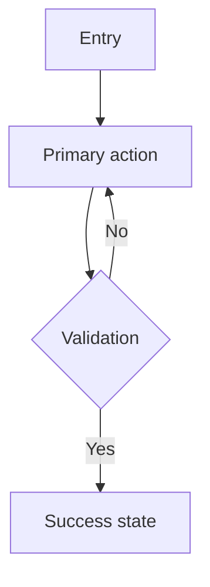

# UX/UI Design Document — {{PROJECT_NAME}}

> Generated by the `ux-ui-design-assessment` skill (Design mode). Replace all `{{PLACEHOLDER}}` markers with concrete content. Delete sections that do not apply; never leave empty headings.

- **Date:** {{YYYY-MM-DD}}
- **Author:** {{agent or human}}
- **Status:** {{draft / reviewed / approved}}

## Design Principles

1. **{{Principle 1: e.g., Clarity}}** — {{why it matters for this product}}.
2. **{{Principle 2: e.g., Efficiency}}** — {{description}}.
3. **{{Principle 3: e.g., Consistency}}** — {{description}}.

## Personas

### {{Persona 1 name}}

- **Demographics:** {{age, role, location, device}}
- **Goals:** {{what they want to achieve}}
- **Behaviors:** {{how they work today}}
- **Pain points:** {{what stops or frustrates them}}
- **Quote:** "{{one line in their voice}}"

### Empathy Map — {{Persona 1}}

| Says | Does |
|------|------|
| {{...}} | {{...}} |

| Thinks | Feels |
|--------|-------|
| {{...}} | {{...}} |

> Keep 2-7 personas total.

## Problem Statement

{{User}} needs {{goal}} because {{reason}}, but today {{pain point / barrier}}. We will know we succeeded when {{observable outcome}}.

## Design Variants Explored

| Variant | Axis explored | Reading pattern | Decision |
|---------|---------------|-----------------|----------|
| A | Information hierarchy | F / Z | {{chosen / rejected — why}} |
| B | Layout model | F / Z | {{...}} |
| C | Density | F / Z | {{...}} |
| D | Interaction model | F / Z | {{...}} |
| E | Expressive direction | F / Z | {{...}} |

> Variants must be meaningfully distinct, not minor tweaks.

## Information Architecture

### Sitemap

{{text outline or mermaid of pages and connections}}

### User Flow — {{primary task}}

> Add one flow per critical journey.

### Taxonomy / Labeling

{{how content is grouped and labeled; note IA principles applied: disclosure, choices, front doors}}

## Screen Inventory

| Screen | Route | Purpose | Key components | Wireframe fidelity |
|--------|-------|---------|----------------|--------------------|
| {{screen}} | {{route}} | {{purpose}} | {{components}} | low / mid / high |

## Visual System

### Typography

- Fonts (max 2): {{heading font}} + {{body font}}
- Base size: 16px, line-height: 1.5
- Hierarchy scale: {{H1..Body sizes}}

### Color

- Scheme: {{palette}}
- Accent (primary actions only): {{color}}
- Semantic: success {{}}, warning {{}}, error {{}}
- Contrast target: 4.5:1 text / 3:1 UI (WCAG 2.1 AA)

### Icon Usage

**Library: [Lucide Icons](https://lucide.dev/)** — reference icons by name. Never use emoji as UI elements.

| Purpose | Icon name | Usage |
|---------|-----------|-------|
| Success | `CheckCircle` | {{where}} |
| Error | `AlertCircle` | {{where}} |
| {{purpose}} | `{{Icon}}` | {{where}} |

## Responsive Strategy

| Breakpoint | Min width | Target |
|------------|-----------|--------|
| mobile | 0 | Phones (portrait) |
| tablet | 768px | Tablets |
| desktop | 1024px | Laptops/desktops |
| wide | 1280px | Large monitors |

- Mobile-first; viewport meta tag present.
- Layout: CSS Grid for page structure, Flexbox for component internals.
- Navigation: {{hamburger on mobile / persistent on desktop}}.
- Touch targets >= 44x44px; no horizontal scroll; zoom not disabled.

## Moodboard

- **Direction:** {{concept and mood}}
- **References:** {{concrete brands / images}}
- **Colors / Fonts:** {{scheme + pairings}}
- **Textures/Materials:** {{if physical product}}

## Component States

Every interactive component must define: default, hover, focus, active, disabled, loading, error, empty.

## Prototype and Usability Test Plan

- **Prototype scope:** {{which flow is clickable / near-real}}
- **Test tasks (open-ended):**
  1. {{"What would you expect this to do?" style task}}
  2. {{...}}
- **What to observe:** hesitation, backtrack, failure points.
- **Principle:** test early, test often; no leading questions.

## Accessibility Requirements

| Requirement | Standard | Implementation |
|-------------|----------|----------------|
| Color contrast | WCAG 2.1 AA (4.5:1 / 3:1) | {{how verified}} |
| Keyboard | Full operability | Tab order, focus, skip links |
| Screen reader | Semantic HTML + ARIA | Landmarks, alt text, live regions |
| Motion | `prefers-reduced-motion` | Disable animations when set |
| Focus | Visible `:focus-visible` | 2px ring with offset |
