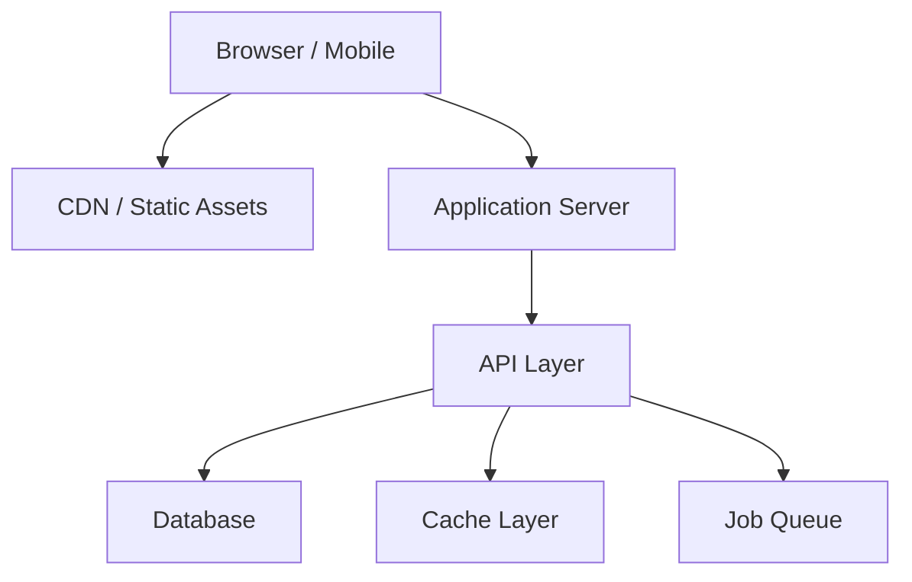

# Tech Stack & Architecture — {{PROJECT_NAME}}

## Tech Stack

| Layer | Technology | Version | Rationale |
|-------|-----------|---------|-----------|
| Frontend | {{e.g., Next.js}} | {{e.g., 15.x}} | {{why chosen}} |
| Styling | {{e.g., Tailwind CSS}} | {{e.g., 4.x}} | {{why chosen}} |
| Backend | {{e.g., Next.js API Routes / Express}} | | {{why chosen}} |
| Database | {{e.g., PostgreSQL}} | {{e.g., 16}} | {{why chosen}} |
| ORM | {{e.g., Prisma / Drizzle}} | | {{why chosen}} |
| Auth | {{e.g., NextAuth.js / Clerk}} | | {{why chosen}} |
| Hosting | {{e.g., Vercel / AWS}} | | {{why chosen}} |
| CI/CD | {{e.g., GitHub Actions}} | | {{why chosen}} |

## Architecture Overview



> ⚠️ TODO: Replace with actual architecture diagram reflecting the chosen stack.

## Directory Structure

```text
{{project-name}}/
├── src/
│   ├── app/              # {{e.g., Next.js app router pages}}
│   ├── components/       # Reusable UI components
│   │   ├── ui/           # Base/primitive components
│   │   └── features/     # Feature-specific components
│   ├── lib/              # Shared utilities, helpers
│   ├── hooks/            # Custom React hooks
│   ├── types/            # TypeScript type definitions
│   ├── styles/           # Global styles, design tokens
│   └── server/           # Server-side logic (API, DB)
│       ├── db/           # Database schema, migrations
│       ├── api/          # API route handlers
│       └── services/     # Business logic layer
├── public/               # Static assets
├── tests/                # Test files
├── docs/                 # Project documentation
└── {{config files}}      # package.json, tsconfig, etc.
```

## Key Dependencies

| Package | Purpose | Notes |
|---------|---------|-------|
| {{package_name}} | {{purpose}} | {{version constraints or notes}} |

## Dev Environment Setup

```bash
# Prerequisites
# - Node.js >= {{version}}
# - {{other prerequisites}}

# Clone and install
git clone {{repo_url}}
cd {{project-name}}
{{package_manager}} install

# Environment variables
cp .env.example .env.local
# Edit .env.local with your values

# Database setup
{{db_setup_command}}

# Start dev server
{{package_manager}} run dev
```

## Deployment Strategy

| Environment | URL | Deploy Method | Branch |
|-------------|-----|---------------|--------|
| Development | localhost:{{port}} | Local dev server | any |
| Staging | {{staging_url}} | {{e.g., auto-deploy on PR}} | develop |
| Production | {{prod_url}} | {{e.g., manual promote}} | main |
