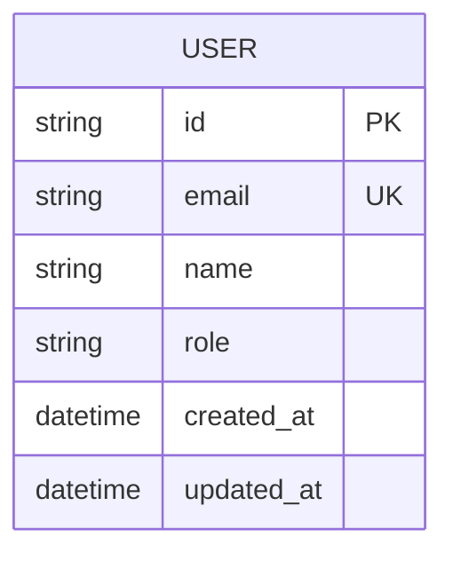
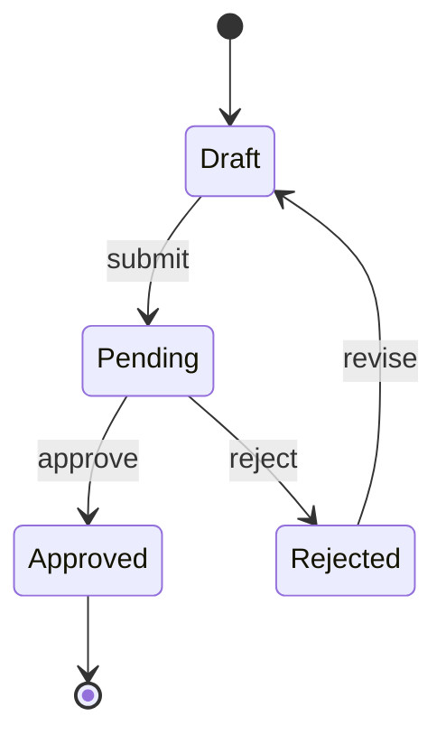
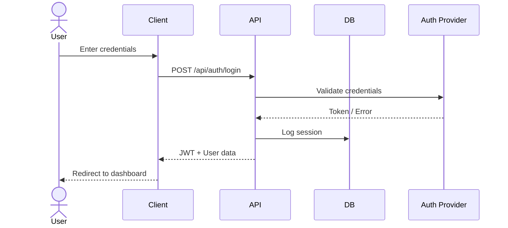

# System Modeling — {{PROJECT_NAME}}

## Entity-Relationship Diagram



> ⚠️ TODO: Replace with actual entity-relationship diagram.

## Data Models

### {{Entity 1: e.g., User}}

| Field | Type | Constraints | Description |
|-------|------|-------------|-------------|
| id | UUID | PK, auto-gen | Unique identifier |
| email | string | unique, not null | User email |
| name | string | not null | Display name |
| role | enum | not null, default: 'user' | USER, ADMIN |
| created_at | datetime | not null, auto | Record creation |
| updated_at | datetime | not null, auto | Last modification |

### {{Entity 2}}

| Field | Type | Constraints | Description |
|-------|------|-------------|-------------|
| id | UUID | PK, auto-gen | Unique identifier |
| {{field}} | {{type}} | {{constraints}} | {{description}} |

## State Diagrams



> ⚠️ TODO: Replace with actual state transitions for key entities.

## API Contract Summary

### {{Resource 1: e.g., /api/users}}

| Method | Endpoint | Description | Auth |
|--------|----------|-------------|------|
| GET | /api/{{resource}} | List all | {{role}} |
| GET | /api/{{resource}}/:id | Get by ID | {{role}} |
| POST | /api/{{resource}} | Create new | {{role}} |
| PATCH | /api/{{resource}}/:id | Update | {{role}} |
| DELETE | /api/{{resource}}/:id | Delete | {{role}} |

### Request/Response Shapes

```json
// POST /api/{{resource}} — Request
{
  "{{field}}": "{{type}}",
  "{{field}}": "{{type}}"
}

// Response (200)
{
  "id": "uuid",
  "{{field}}": "{{value}}",
  "created_at": "ISO8601"
}
```

## Sequence Diagrams

### {{Key Flow: e.g., User Authentication}}



> ⚠️ TODO: Add sequence diagrams for all critical user flows.
