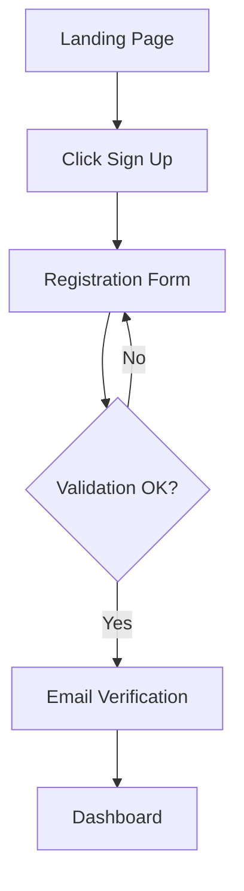
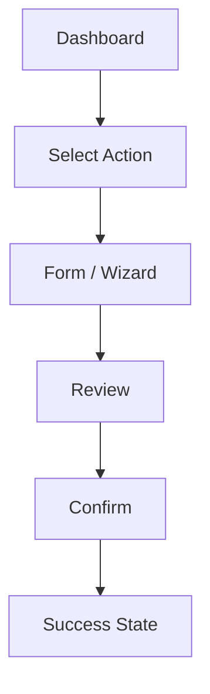

# UX/UI Design — {{PROJECT_NAME}}

> **NO EMOJI in this file.** Use Lucide Icons or named SVGs for all visual indicators.

## Design Principles

1. **{{Principle 1: e.g., Clarity}}** — {{description}}
2. **{{Principle 2: e.g., Efficiency}}** — {{description}}
3. **{{Principle 3: e.g., Consistency}}** — {{description}}

## User Flows

### {{Flow 1: e.g., Registration}}

### {{Flow 2: e.g., Core Task}}

> Add one flow diagram per critical user journey.

## Screen Inventory

| Screen | Route | Purpose | Key Components |
|--------|-------|---------|----------------|
| Landing | / | First impression, CTA | Hero, Features, CTA |
| Login | /login | Authentication | Form, OAuth buttons |
| Dashboard | /dashboard | Main workspace | Sidebar, Cards, Table |
| {{screen}} | {{route}} | {{purpose}} | {{components}} |

## Component Library

### Icon Usage

**Library: [Lucide Icons](https://lucide.dev/)**

Reference icons by name. Never use emoji as UI elements.

| Purpose | Icon Name | Usage |
|---------|-----------|-------|
| Success | `CheckCircle` | Confirmation messages, completed states |
| Error | `AlertCircle` | Error messages, validation failures |
| Warning | `AlertTriangle` | Warning banners, caution states |
| Info | `Info` | Informational tooltips, help text |
| Loading | `Loader2` | Spinner for async operations |
| Search | `Search` | Search inputs |
| Settings | `Settings` | User preferences, config |
| User | `User` | Profile, avatar placeholder |
| Close | `X` | Dismiss modals, notifications |
| Menu | `Menu` | Mobile navigation toggle |

### Status Indicators

Use icon + color combinations. Never emoji.

| Status | Icon | Color Token | Example |
|--------|------|-------------|---------|
| Active | `CheckCircle` | `--color-success` | Active subscription |
| Pending | `Clock` | `--color-warning` | Awaiting approval |
| Error | `XCircle` | `--color-error` | Failed operation |
| Disabled | `MinusCircle` | `--color-muted` | Inactive feature |

## Responsive Breakpoints

| Name | Min Width | Target Devices |
|------|-----------|----------------|
| mobile | 0 | Phones (portrait) |
| tablet | 768px | Tablets, phones (landscape) |
| desktop | 1024px | Laptops, desktops |
| wide | 1280px | Large monitors |

## Layout Strategy

- **Mobile-first** approach — base styles target mobile, scale up via media queries
- **Primary layout**: CSS Grid for page structure, Flexbox for component internals
- **Sidebar**: Collapsible on mobile (off-canvas), persistent on desktop
- **Max content width**: {{e.g., 1200px}} with centered container

## Accessibility Requirements

| Requirement | Standard | Implementation |
|-------------|----------|----------------|
| Color contrast | WCAG 2.1 AA (4.5:1 text, 3:1 large) | Verify all color token pairs |
| Keyboard navigation | Full keyboard operability | Tab order, focus indicators, skip links |
| Screen reader | Semantic HTML + ARIA labels | Landmarks, alt text, live regions |
| Motion | Respect `prefers-reduced-motion` | Disable animations when set |
| Focus indicators | Visible on all interactive elements | Custom `:focus-visible` styles |
